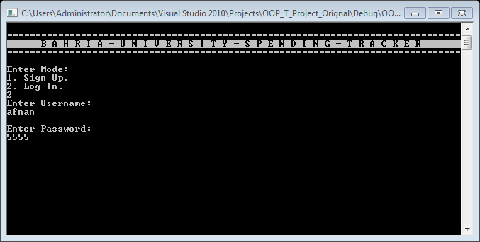
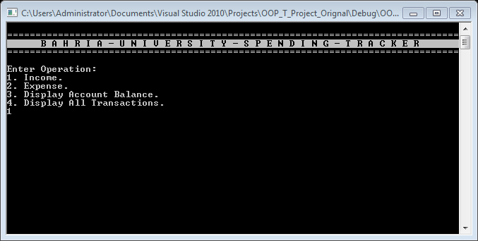
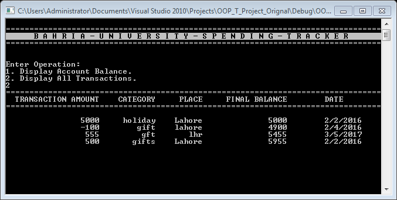

# oop-semester-project
Object Oriented Programming Semester Project

### Introduction:
Spending Tracker is basically an application which keeps record of the daily Income and Expenses of the user. It helps the user to maintains his daily budget and saves money by keeping an eye on his spending.

### OOP Concepts Used:
1.	Inheritance.
2.	Polymorphism.
3.	Composition.
4.	Operator Overloading.
5.	Operator Overriding.
6.	Files and Streams.
7.	Pointers.
8.	Classes.
9.	Functions.
10. Strings

### Application Features:
* Secure Sign Up and Log In.
* Separate file for each user which can’t be accessed without password.
* Add Incomes/Expenses with information such as date, place, and category.
* Displays remaining balance in Account.
* Displays Transactions List of the user
* Best and most important feature is that it can be used on a Public PC where each user has its own USERNAME and PASSWORD and has its own separate file which can’t be accessed without password. 

